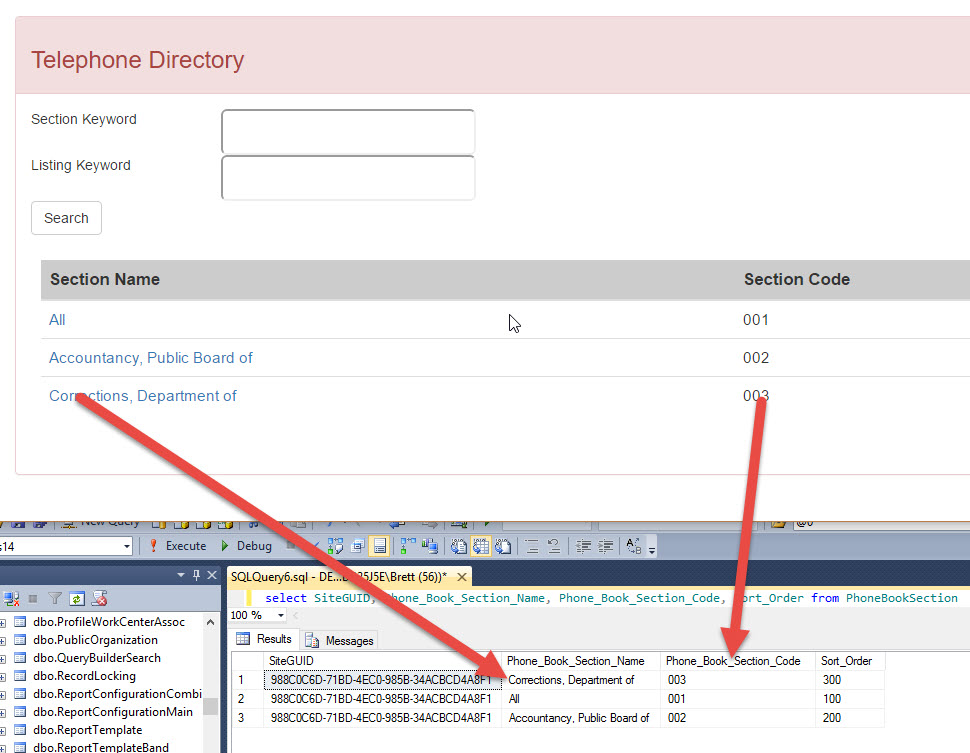
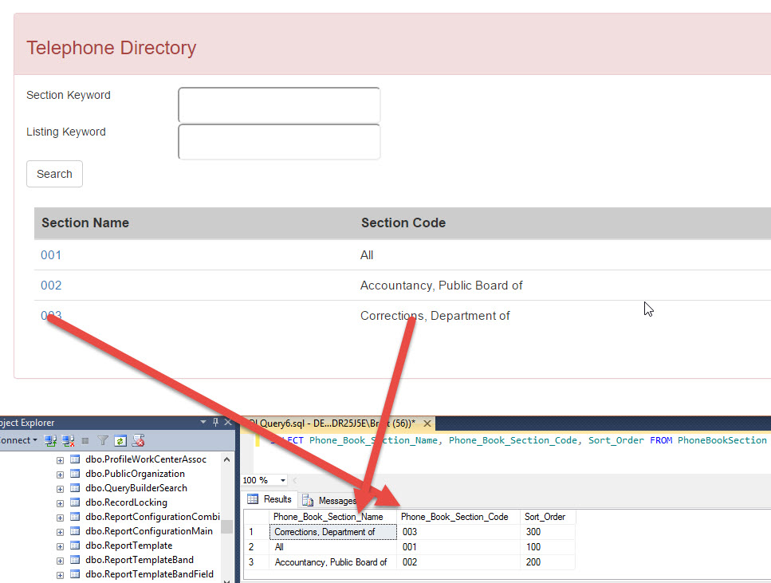
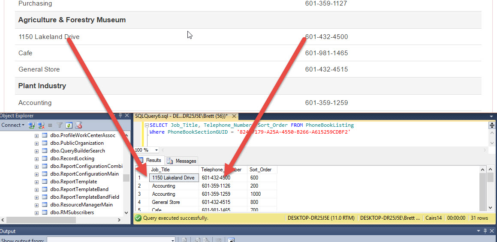
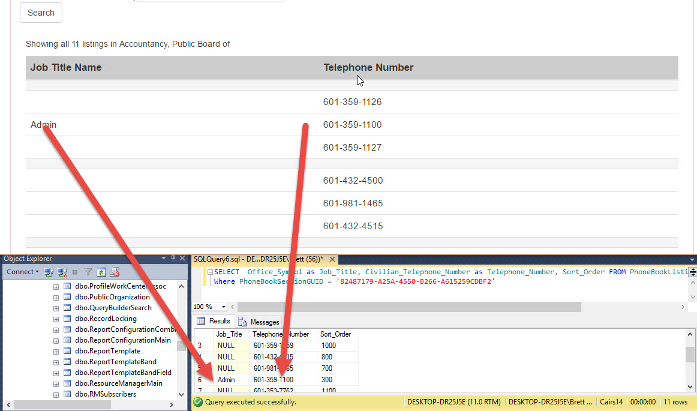

.. include:: /common/stub-variables.txt

Cairs Interfacing
=================

This document describes the Cairs versions supported and how to configure the backend queries to support other Cairs versions.

.. note: The current out of the box supported version of Cairs is 4.0.14.16403

How to Configure Backend SQL Queries
------------------------------------

.. note: There are only two reasons to change the SQL queries.  1. to add/remove or change fields displayed in the UI.  2. to connect to a different version of Cairs than this currently supports.

The backend queries used by the |product| are configured in the /config/phonebook.config file.

There are three queries that need to be configured.

@0 Parameters
~~~~~~~~~~~~~
Each search query uses parameters to perform the searches.  Each parameter is defined with an @ at the beginning.  They might define a GUID or a Search Keyword.

.. warning: Search queries must remain in the right place in order for the system to work.

Select Search Query
~~~~~~~~~~~~~~~~~~~

This is the query used to search the Cairs PhoneBookSection table.  When the end users supplies only a Selection Keyword this query will be ran.

Selection And Listing Search Query
~~~~~~~~~~~~~~~~~~~~~~~~~~~~~~~~~~

This is the query used to search the PhonebookSection and PhonebookListing table.  When the end user supplies both the Section Keyword and the Listing Keyword this will return a result of Sections.

Listing Search Query
~~~~~~~~~~~~~~~~~~~~

This is the query used to search the PhonebookListing table.  When the end user supplies a Section GUID (by clicking on a section) and the Listing Keyword this will return a result of Listings.

Two Very Import Section Fields
------------------------------

Phone_Book_Section_Name and Phone_Book_Section_Code are the fields that show data in the phonebook.  If either of these fields are missing from the query no data will be displayed.  Also if these fields are renamed the phonebook will show the data in the renamed fields.  

**How to change display fields**

This example makes more sense in the Listings area described below but can be accomplished in both by changing the queryies.

For example if the customer wants to show the Phone_Book_Section_Code in the first column instead of the Phone_Book_Section_Name:

Initial query (simplified)::

   SELECT Phone_Book_Section_Name, Phone_Book_Section_Code, Sort_Order FROM PhoneBookSection

In the query Phone_Book_Section_Name is the first column.

Modifed query::

   SELECT Phone_Book_Section_Code as Phone_Book_Section_Name, Phone_Book_Section_Name as Phone_Book_Section_Code, Sort_Order FROM PhoneBookSection

In this case the Code will become the first column.  See the image below.

Two very Important Listing Fields
---------------------------------

Telephone_Number and Job_Title are the fields that show data on the phonebook.  If either of those fields are missing from the query no data will be displayed.  Also if these fields are renamed in the query the phonebook will show the data in the renamed fields.

**How to change display fields**

Modify the query to change the fields.

Initial query (simplified)::

   SELECT  Job_Title, Telephone_Number, Sort_Order FROM PhoneBookListing

In the query Job_Title is the first column. To change the field and make Office_Symbol the first column, simply change the query.  

Modifed query (simplified)::

   SELECT  Office_Symbol as Job_Title, Civilian_Telephone_Number as Telephone_Number, Sort_Order FROM PhoneBookListing

In this case the Office_Symbol renamed will be the first column.  See the image below.

