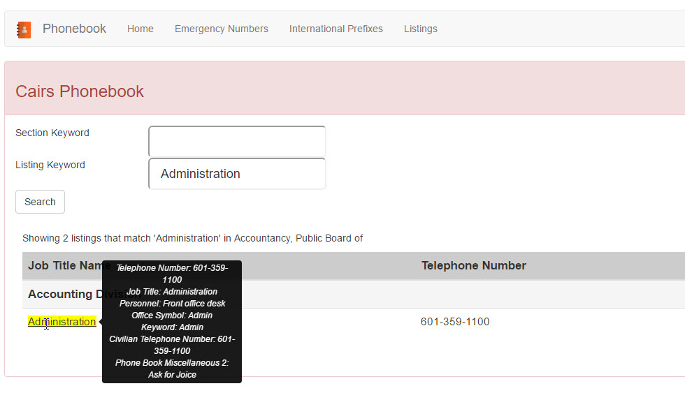

.. include:: /common/stub-variables.txt

How The Search Works
====================

The Sections and Listings come directly from the Cairs database.  These have to be setup in order for the search to work properly.

The |product| search filters by Section then by Listing and honors the Indent Level offered by Cairs.

When the search button is clicked the Sections that match will be displayed.  Then the user can click on a Section to show the listings hierarchy. 

Example Data
------------

For the search examples below we have the following structure.

Cairs View of the Data
~~~~~~~~~~~~~~~~~~~~~~

.. thumbnail:: images/cairs_phonebook_view.jpg

Phonebook View of the Data
~~~~~~~~~~~~~~~~~~~~~~~~~~

**Sections**

.. thumbnail:: images/all_sections.jpg

**Accountancy Expanded**

.. thumbnail:: images/accountancy_full.jpg

**Corrections Expanded**

.. thumbnail:: images/corrections_full.jpg

Example 1 Section Search Only
~~~~~~~~~~~~~~~~~~~~~~~~~~~~~

.. note:: When Section keyword is searched alone only the Section names will be filtered and displayed.

.. thumbnail:: images/account_search.jpg

Notice that the text 'Account' is highlighted in the Section Name.  This is because it matches the Section keyword. 

Example 2 Accountancy Selection
~~~~~~~~~~~~~~~~~~~~~~~~~~~~~~~

.. note:: Click on a Section without a Listing Keyword to show the hierarchy of the listing table.

.. thumbnail:: images/account_search_full.jpg

Notice that the Listing Keyword field is empty so the page shows all of the listings in the right order with the correct hierarchy.

Example 3 Section & Listing Search 
~~~~~~~~~~~~~~~~~~~~~~~~~~~~~~~~~~

.. note:: When the Section keyword *and* Listing keyword is searched all of the Sections that match the name *and* have listings that match be displayed.

Notice that becuase Accountancy *and* Correction both have a sub listing of Administration both Sections are displayed.

.. thumbnail:: images/listing_search_both.jpg

**Click on Accountancy**

Clicking the Accountancy Section will show the hierarchy of the listing. Because the Listing Keyword is 'Administration' all of the listings in Accountancy are filtered by that keyword.

.. thumbnail:: images/listing_search_admin.jpg

Notice that the Department 'Accounting Division' is displayed above the Administration listing.  This is becuase the 'Accounting Division' record in Cairs has a Indent Level of 0 and the Administration listing under 'Accounting Division' has an Indent Level of 2.

More Information
~~~~~~~~~~~~~~~~

The |product| shows the Job Description field and the Telephone Number field by default.  To see more information hover over the Job Description field.

The fields displayed here can be modified by changing the SQL query used to build these listings.

