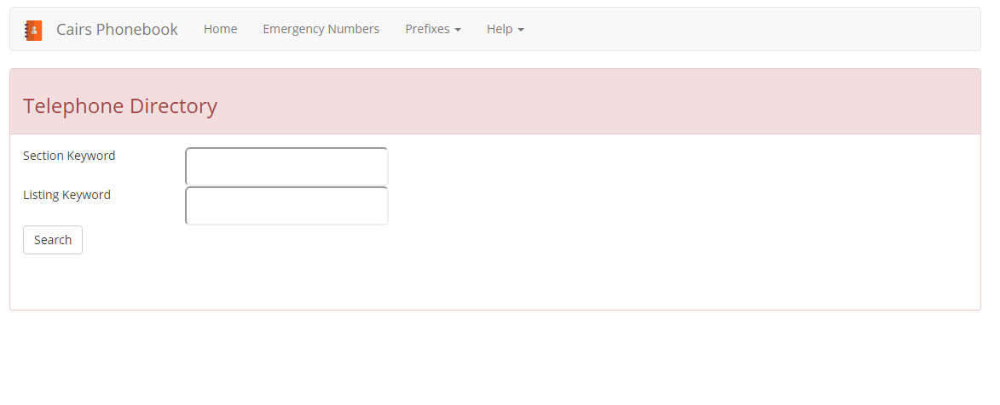
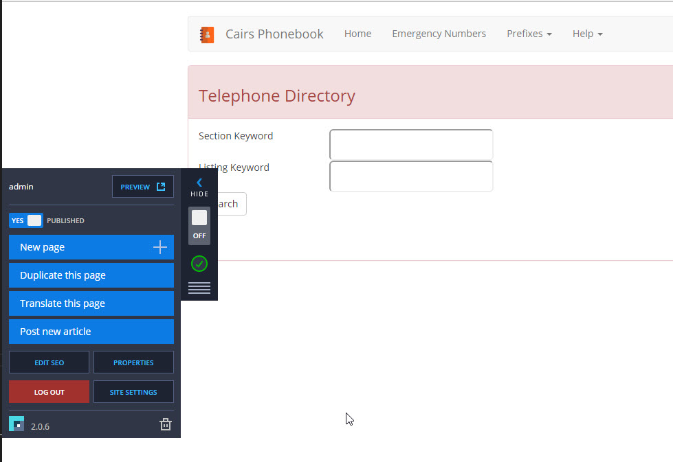

.. include:: /common/stub-variables.txt

Server 2012 Installation
========================

This document will help you get |product| installed and running on a Server 2012r2 server.  There are two phases to this installation.  

#. IIS Configuration
#. SQL Configuration

After both phases are complete the |product| will be ready to run. This documentation are developed by using an 2012 r2 DoD image.

IIS Configuration
-----------------

The |product| can be ran from the root of an IIS Website or from an IIS Folder/Virtual Directory.  

The IIS Website setup will allow the |product| to run at a top level, for example your url will be: www.myphonebook.com. When installed as a folder the url would look like this www.myphonebook.com/phonebook.

**Prerequisites**:

#. Before performing either of the steps below be sure to install and configure IIS by following this guide. https://www.iis.net/learn/application-frameworks/scenario-build-an-aspnet-website-on-iis/configuring-step-1-install-iis-and-asp-net-modules
#. Create an Application Pool named Phonebook with .net v4.0 and Managed Pipline mode as Integrated.

Run As IIS Website
~~~~~~~~~~~~~~~~~~
Follow the steps below to run |product| from the root of an IIS Website.

The steps below assume that you are installing the phonebook at "C:\\Inetpub\\wwwroot\\".  This path, or a different one if you choose, will be known as your Root path in the following steps.    

* Copy the Release folder of |product| to your Root path
* Open IIS and expand the nodes until you reach Default Web Site
* Ensure Default Web Site is selected then select Basic Settings....
* In the Physical Path paste the entire Root path
* Click the Select... button and set the Application Pool to Phonebook (created above)
* Click OK to close the Edit Site window

**Configure the connection string**

* In IIS ensure that Default Web Site is selected and in the ASP.NET section double click "Connection Strings"
* Use the connection string settings to the Cairs database
* Ensure that the DefaultConnection connection string and LocalSqlServer connection string are the same  

Run As IIS Folder
~~~~~~~~~~~~~~~~~

Follow the steps below to run |product| from the root of an IIS Website.

The steps below assume that you are installing the phonebook at "C:\\Inetpub\\wwwroot\\phonebook".  This path, or a different one if you choose, will be known as your Root path in the following steps.    

* Copy the Release folder of |product| to your Root path
* Open IIS and expand the nodes until you reach Default Web Site and select the Phonebook folder
* Select Basic Settings....
* In the Physical Path paste the entire Root path
* Click the Select... button and set the Application Pool to Phonebook (created above)
* Click OK to close the Edit Site window

**Configure the connection string**

* In IIS ensure that Default Web Site\Phonebook folder is selected and in the ASP.NET section double click "Connection Strings"
* Use the connection string settings to the Cairs database
* Ensure that the DefaultConnection connection string and LocalSqlServer connection string are the same  

IIS Permissions
~~~~~~~~~~~~~~~

Regarless of the installation method used Permissions must be set.

**Configure Permissions**

* Navigate to the Root directory, right click on the Root directory and click Properties
* Select the Security tab
* Click the Edit.... button
* Click the Add... button
* In the object names text box enter the following: IUSR;IIS_IUSRS
* Click the Check Names buttons, if you have no errors continue
   * If you have errors make sure that the names are spelled correctly and also that the location is the local computer, not the domain.
* Click OK and close all of the dialog boxes

SQL Configuration
-----------------

The steps below will help prepare the SQL database for |product|.

The |product| needs it's own set of tables.  The steps below will walk you through the creation of these tables using an existing Cairs database.  

There are two steps.  Create the tables and then populate the tables with default data.

Create the Tables
~~~~~~~~~~~~~~~~~

.. warning:: Before proceeding make a backup of your Cairs database. Make a backup of your Cairs database right now.  Please, PLEASE, **PLEASE** make a backup first.  Measure twice, cut once!

When running |product| for the first time the required tables will be created.

On a client computer open a web browser and type in the IP address or Host name of the Windows 2012 Server.  

IIS Folder configuration uses:  http://IP_Address/phonebook
IIS Website configuration uses:   http://IP_Address/   

Behind the scenes the database tables will be created.  

.. warning:: When you get to the Registration page DO NOT REGISTER!  The default data will take care of the registration process.

Configure Default Data
~~~~~~~~~~~~~~~~~~~~~~

#. Open SQL Server Management Studio connected to the Cairs database
#. Select the Cairs database
#. Download :download:`database structure doc <downloads/phonebook_database_defaults.sql>` (right click, save link as...) and open it in the SQL Server Mangement window
#. Run the database defaults file by pressing F5

After both processes are complete the |product| database is ready. 

.. note:: Make sure you know the Database connection string information.  You will need it in the following steps.

Test the installation
---------------------

To test the installation you will need to open the website on a client computer.

On the client computer open a web browser and type in the IP address or Host name of the Windows 2012 Server.  

IIS Folder configuration uses:  http://IP_Address/phonebook
IIS Website configuration uses:   http://IP_Address/

If the browser address is set to http://localhost/bcms-users/register please set it back to http://localhost then press enter to try again.

The website should look like this:

Test the Admin Area
-------------------

To test the admin area of the |product| enter http://localhost/login into the browser and enter the default username and password.

.. note:: The default Username and Password is admin password.

You should see a page that looks like this:

To learn how to add new pages and add modify content to the site go to :ref:`cms-features`.